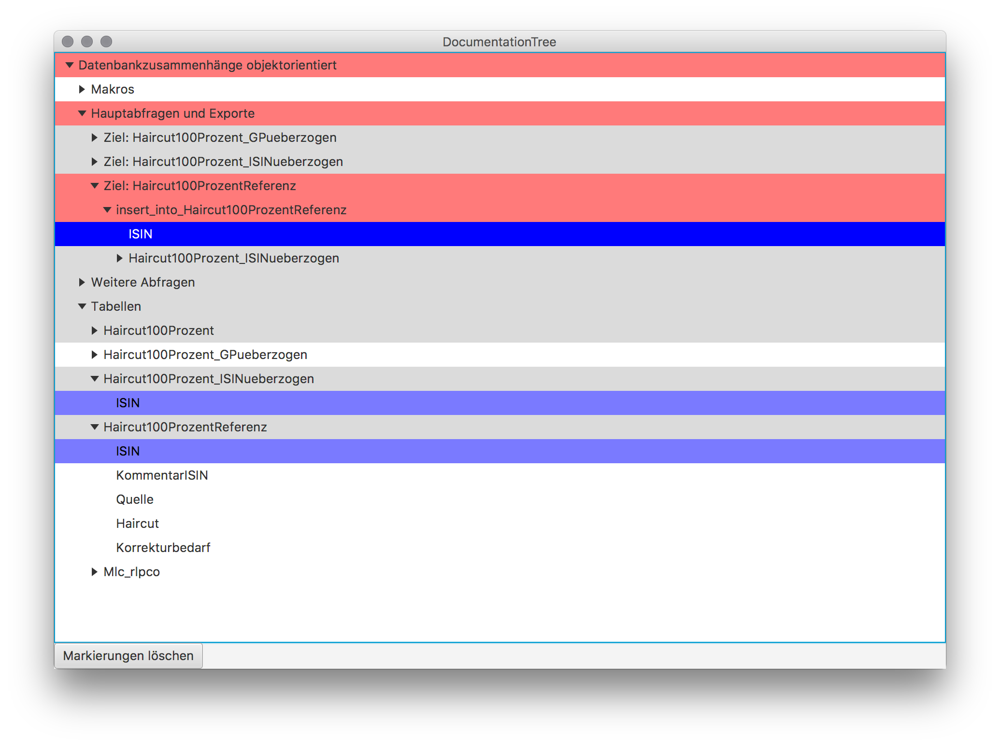

= {appname} - UserGuide
Jens Kötterheinrich <jkh@beckmann-partner.de>
2018-02-20
:appversion: 1.0
:source-highlighter: coderay
:listing-caption: Listing
:pdf-page-size: A4
:appname: DocumentationTree
:lang: de
:sectnums:

== Voraussetzung
Um die Anwendung starten zu können, wird mindestens Java-Version 7 vorausgesetzt.

== Start
Die Anwendung kann mit einem (Doppel-)Klick auf die Jar-Datei gestartet werden.

Alternativ lässt sich die Anwendung auch über eine Konsoleneingabe starten:
----
java -jar documentationtree-<Version>-jar-with-dependencies.jar
----
Dazu muss documentationtree-<Version>-jar-with-dependencies.jar im aktuellen Verzeichnis liegen.

Beim Start erscheint folgender Dialog:

image::Startbildschirm.png[Startbildschirm]

Das Verzeichnis wird initial immer auf das Verzeichnis, in dem die Jar-Datei liegt, eingestellt.

Hier ist eine Datei auszuwählen, die eine Lua-Table enthält, die über

[source,lua]
----
return <table>
----

zurückgegeben wird.

== Darstellung
=== Datei öffnen
Kann die Datei gelesen und geöffnet werden, wird der Inhalt der Datei wie folgt angezeigt:

image::VollerBaum.png[Anzeige der Daten aus einer Lua-Table-Datei]

=== Knoten markieren
Beim Klick auf den Button "Markieren" werden Knoten nach folgenden Regeln gefärbt:name: value

1. Der ausgewählte Knoten wird in blau gefärbt.
2. Knoten, deren Text mit dem des ausgewählten Knoten identisch sind, werden blau gefärbt.
3. Knoten über dem ausgewählten Knoten werden rot gefärbt; Knoten über den Knoten von 2. werden grau gefärbt.
4. Knoten unter dem ausgewählten Knoten werden grün gefärbt.

Durch einen Klick auf den Button "Markierungen löschen" werden alle gefärbten Knoten in ihren Ursprungszustand zurückgesetzt.
