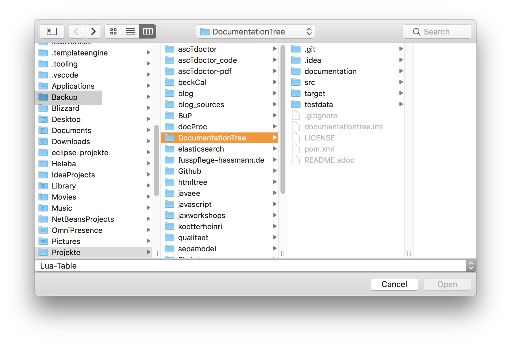
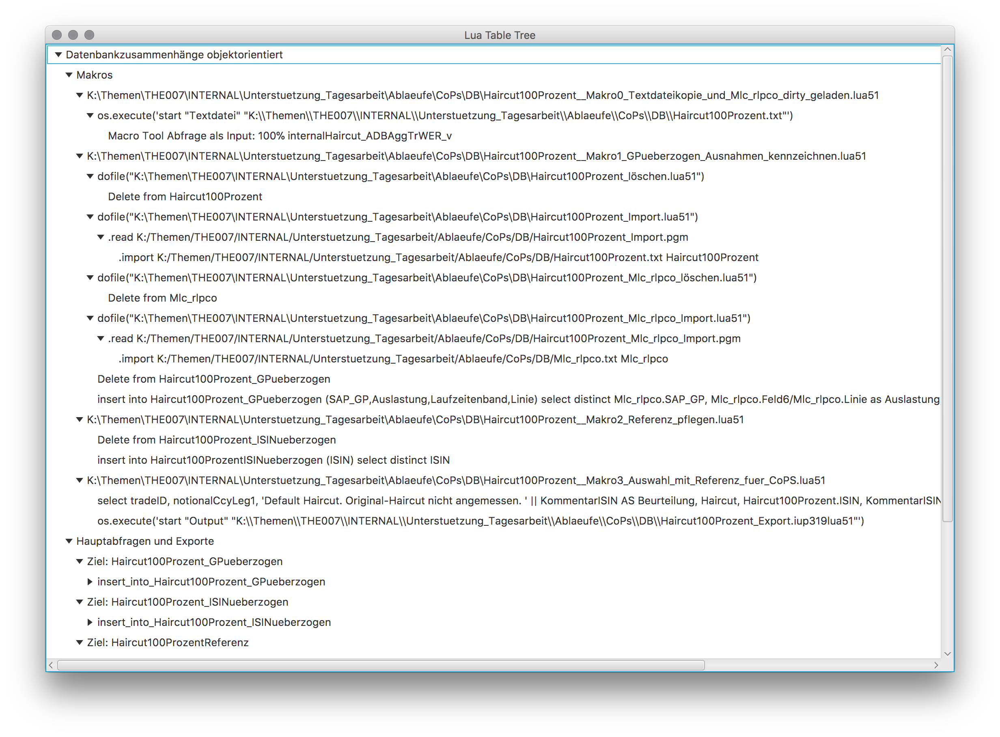

= JLuaTree
Jens Kötterheinrich <jkh@beckmann-partner.de>
2017-10-24
:appversion: 1.0
:doctype: book
:source-highlighter: coderay
:listing-caption: Listing
:pdf-page-size: A4

== Voraussetzung
Um die Anwendung starten zu können, wird mindestens eine Java-Version 8 vorausgesetzt.

== Start
Die Anwendung kann mit einem Doppelklick auf die Jar-Datei gestartet werden.

Alternativ lässt sich die Anwendung auch über eine Konsoleneingabe starten:
----
java -jar jluatree-<Version>-jar-with-dependencies.jar
----
Dazu muss jluatree-<Version>-jar-with-dependencies.jar im aktuellen Verzeichnis liegen.

Beim Start erscheint folgender Dialog:

Das Verzeichnis wird initial immer auf das Verzeichnis, in dem die Jar-Datei liegt, eingestellt.

Hier ist eine Datei auszuwählen, die eine Lua-Table enthält, die über

[source,lua]
----
return <table>
----

zurückgegeben wird.

== Darstellung
Wurde eine nach dem Schema valide XML-Datei geöffnet, wird der Inhalt der Datei wie folgt angezeigt:

